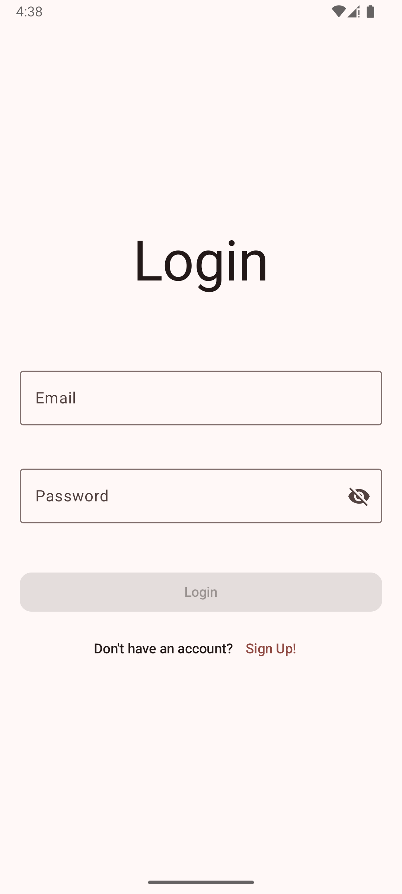
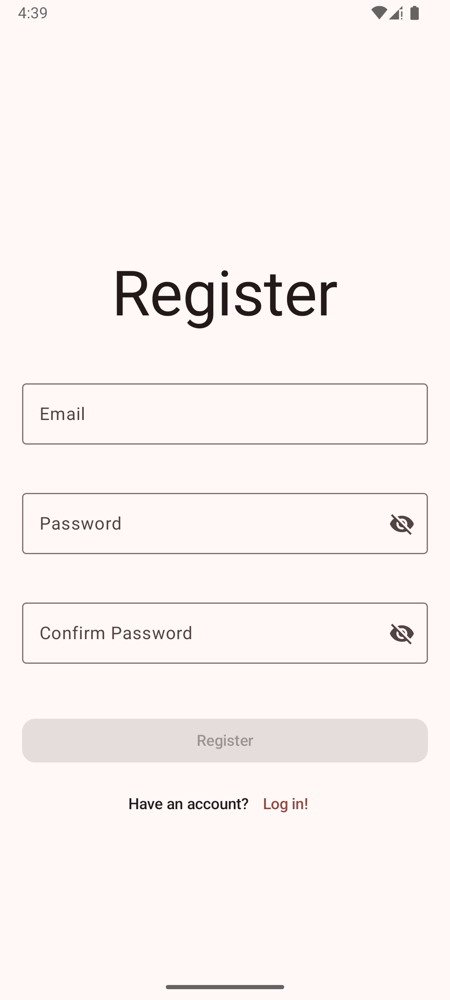
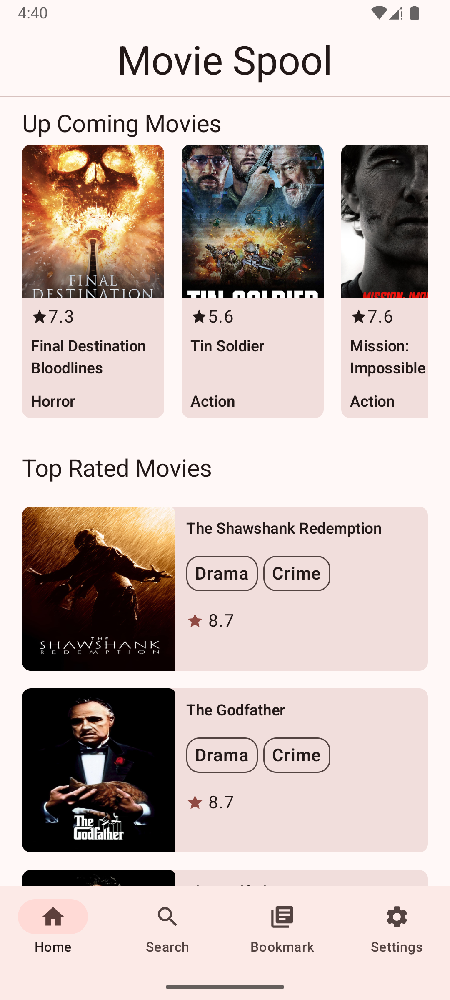
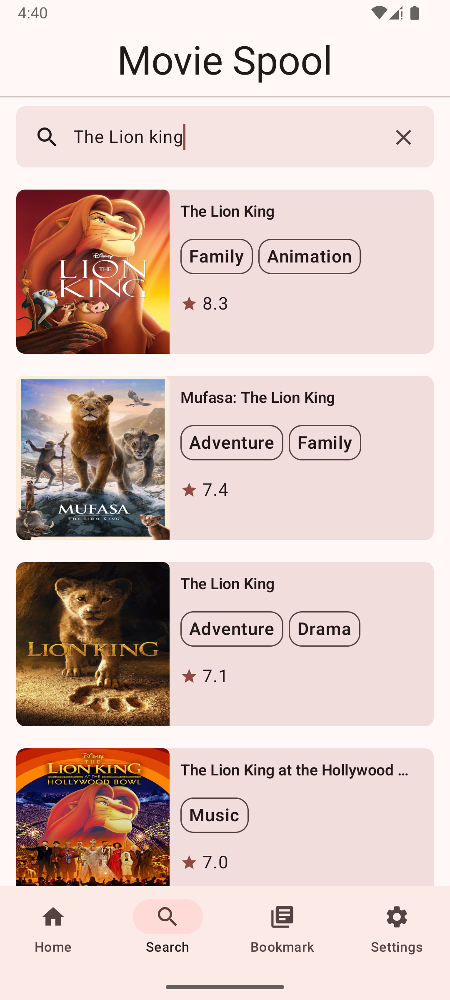
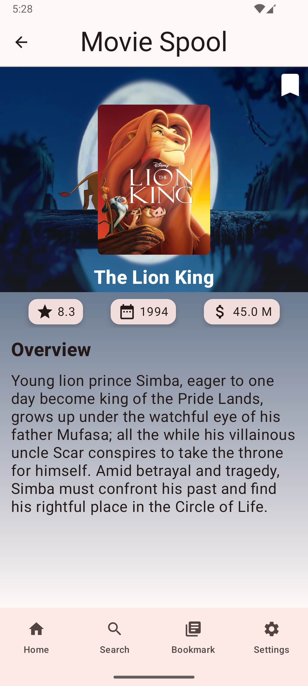
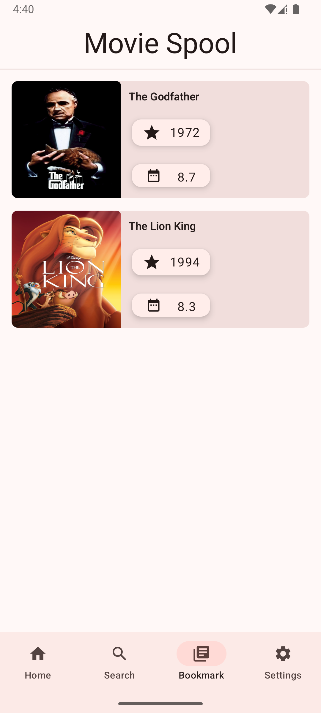
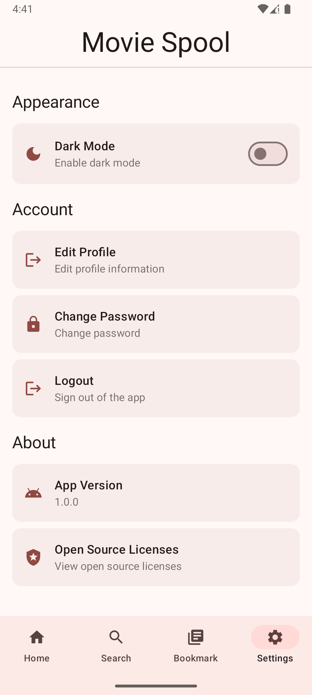

# 🎬 MovieSpool

MovieSpool is a modern Android application built with Jetpack Compose and structured around MVVM and Clean Architecture principles. The app allows users to browse and search movies, add favorites to bookmarks, and securely register or log in using Firebase Authentication. It delivers a smooth and personalized movie experience tailored to each user.

---

## 🖼️ Screenshots

| Login Screen                            | Register Screen                         |
|-----------------------------------------|-----------------------------------------|
|        |  |
| Home Screen                             | Search Screen                           |
|          |      |
| Detail Screen                           | Bookmark Screen                         |
|      |  |
| Settings Screen                         |
|  |
---

## 📚 Features

- 🔥 **Popular & Top Rated Movies** — Browse trending and highly rated films via TMDB API.
- 🔍 **Search** — Search for specific movies by title.
- 🎬 **Movie Details** — View movie description, genres, release date, and rating.
- 🧑‍💼 **Firebase Authentication** — Sign up and log in securely.
- 🌙 **Theme Mode** — Toggle between dark and light theme.
- 🔄 **Swipe to Refresh** — Pull down to refresh movie listings.
- 🎨 **Palette API** — Dynamic UI colors based on movie posters.
- ⚙️ **Paging & Caching** — Efficient data loading and offline support with Room and Paging.

## 🛠️ Tech Stack

- **Kotlin**
- **Jetpack Compose** – Modern declarative UI
- **MVVM & Clean Architecture** – Separation of concerns, testability
- **Coroutines & Flow** – Async data handling
- **Hilt (Dagger)** – Dependency Injection
- **Retrofit + Gson + OkHttp** – API communication
- **Firebase Authentication**
- **Room Database + Paging 3** – Local caching and pagination
- **Jetpack Navigation Compose** – Navigation between screens
- **DataStore** – Persistent preferences (theme mode)
- **Coil** – Image loading
- **Palette API** – UI color extraction
- **SwipeRefresh (Accompanist)** – Pull-to-refresh

## 📂 Project Structure
Below is the overview of the project directory structure, reflecting Clean Architecture principles and modular UI components.
```
├── data
│ ├── local
│ │ ├── mapper
│ │ └── preferences
│ ├── remote
│ │ ├── mapper
│ │ ├── model
│ │ └── paging
│ └── repository
├── di
├── domain
│ ├── model
│ ├── repository
│ └── usecase
│ ├── auth
│ ├── movies
│ ├── bookmark
│ └── settings
├── navigation
├── presentation
│ ├── authorization
│ │ └── components
│ ├── login
│ │ └── components
│ ├── register
│ │ └── components
│ ├── bookmark
│ │ └── components
│ ├── detail
│ │ └── component
│ ├── home
│ │ └── component
│ ├── search
│ │ └── component
│ ├── settings
│ │ └── component
│ ├── component
│ └── theme
├── util
└── BootcampfinalApp.kt
```